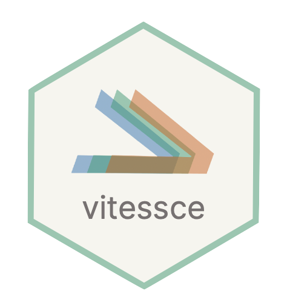
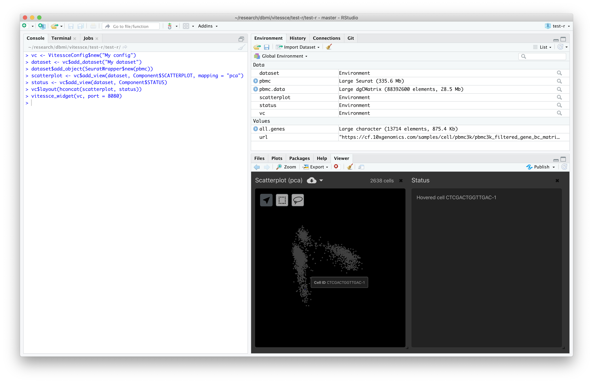

 

# vitessce-r

R API and htmlwidget facilitating interactive visualization of spatial single-cell data with [Vitessce](https://github.com/vitessce/vitessce).

## Installation

Installation requires R 4.0.0 or greater.

```r
install.packages("devtools")
devtools::install_github("vitessce/vitessce-r")
```

## Usage

```r
library(vitessce)

vc <- VitessceConfig$new()
vc$widget()
```

For full examples, visit the [documentation](https://vitessce.github.io/vitessce-r/).



## Development

```sh
npm install
npm run build
```

```r
setwd("path/to/vitessce-r")
install.packages("htmlwidgets")
install.packages("devtools")
devtools::install()
devtools::load_all()
```

## Testing

```r
devtools::check()
devtools::test()
```

## Documentation

```r
install.packages("devtools")
install.packages("pkgdown")
devtools::document()
pkgdown::build_site()
```

## Resources

- [htmlwidgets: creating a widget](http://www.htmlwidgets.org/develop_intro.html)
- [r leaflet](https://github.com/rstudio/leaflet)
- [R packages](https://r-pkgs.org/)
- [roxygen2 syntax](https://cran.r-project.org/web/packages/roxygen2/vignettes/rd-formatting.html)
- [R6](https://r6.r-lib.org/index.html)
- [R6 roxygen2 syntax](https://www.tidyverse.org/blog/2019/11/roxygen2-7-0-0/#r6-documentation)
- [plumber: programmatic usage](https://www.rplumber.io/articles/programmatic-usage.html)
- [pkgdown](https://pkgdown.r-lib.org/)
- [S4](http://adv-r.had.co.nz/S4.html)
